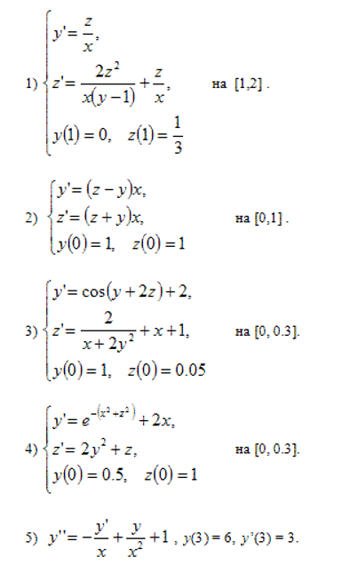

# Computer Modeling
## Lab #2
Simulink: modeling of dynamic systems in the Simulink environment.
### Task:
1. Solve the given differential equation ` x '(t) + 2x (t) = sin (t), x (0) = 0 ` and build a schematic diagram of the solution in the Simulink system, get a solution graph. Check solutions with MatLab using the ode45 function.

2. Build a solution diagram in Simulink and get a schedule for solving the following problems:

  

