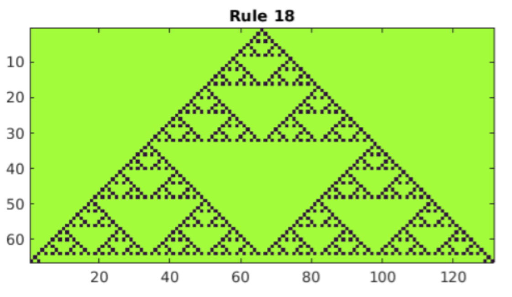
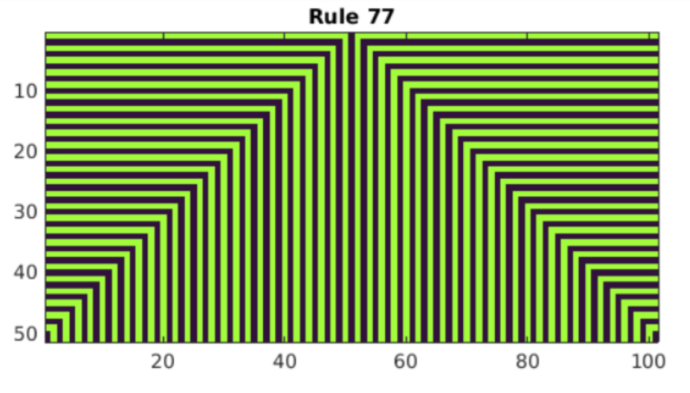

# Computer Modeling
## Lab #3
Modeling of cellular automata
### Task:
1. Get acquainted with the Life program in Matlab
2. Study the work of Conway's life program
3. For a "chaotic" initial configuration in which each cell is in state 1, consider the temporal evolution of rule 00010010 (rule 18), rule 01001001 (rule 73), and rule 10001000 (rule 136) with a 50% probability.
### Work results:

  
  
  

