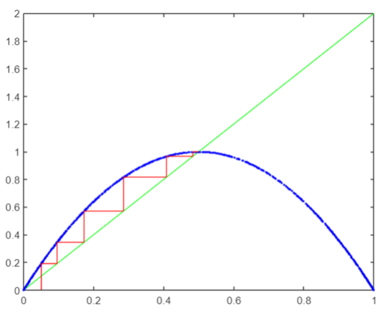

# Computer Modeling
## Lab #4
Modeling a dynamic neuron. Graphical model exploration.
### Task:
1. Develop an algorithm and write a program in the Matlab system to solve the difference equation
`x_(n+1)  = 4 * x_n (1 + x_n)`.
2. Construct a Lameré diagram and find fixed stable points.
3. To study the main types of neurons, which are presented in the subsystem Neural Networks Matlab package.
### Work results:

  

