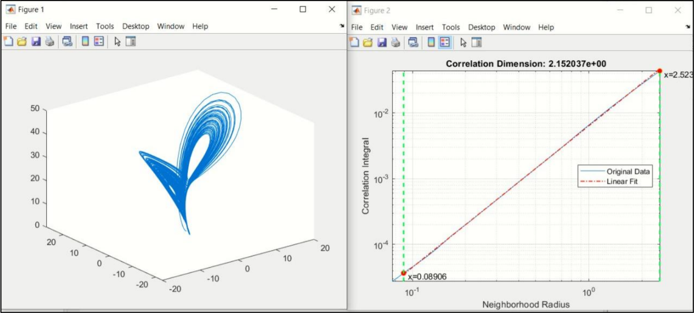

# Computer Modeling
## Lab #5
Reconstruction of a mathematical model by time series.
### Task:
1. Write a program in the Matlab system for solving Lorentz equations with a chaotic attractor. Develop an algorithm and analyze the properties of stationary points of the obtained system by changing the parameter ρ.
2. Using the variable x(t) of the Lorentz equation, calculate the correlation integral.
3. Calculate the correlation dimension graphically.
### Work results:

  

